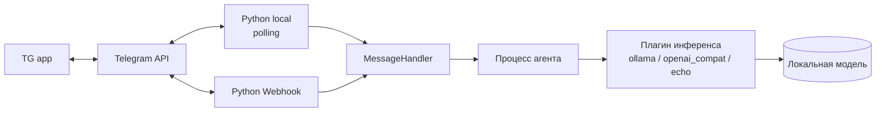

# План: Telegram-бот с локальной LLM (Ollama)

## 1. Цель

Telegram-бот, работающий по схеме `User Message → LLM → Bot Reply`, без памяти диалога:
каждое сообщение — независимый одноразовый запрос.

Сверх базового функционала заложены три архитектурных требования:

1. **Расширяемая архитектура** — новые возможности добавляются файлом, а не правкой ядра.
2. **Инференс как плагин** — чем именно считается ответ, выбирается конфигурацией.
3. **Вызов агента — независимый процесс** — обращение к LLM живёт вне процесса бота.

## 2. Выбранный стек

| Компонент | Решение | Обоснование |
|---|---|---|
| Язык | **Python 3.14** (уже установлен) | Быстрый старт, есть в системе |
| Telegram API | **Чистый HTTP через `urllib` (stdlib)** | Выполняем опциональное требование: без сторонних библиотек → ноль supply chain рисков, понимание Bot API изнутри |
| LLM | **Ollama** (`/api/generate`), плагином | Локальная модель, без внешних ключей |
| Модель | `qwen3:1.7b` (fallback `tinyllama`) | Рекомендация задания, влезает в память |
| Конфиг | `.env` + собственный парсер (stdlib) | `TELEGRAM_BOT_TOKEN` не в коде и не в git |
| Изоляция инференса | `multiprocessing` (spawn) | Жёсткий таймаут и защита бота от падения модели |
| Зависимости | **Нет** | Полностью на стандартной библиотеке |
| Деплой | **Docker Compose** (bot + ollama) на VPS | Один артефакт, воспроизводимый запуск локально и на сервере |
| Транспорт апдейтов | **Long polling** (по умолчанию) + **webhook** | Оба реализованы как сменные плагины |

## 3. Архитектура



Три слоя, каждый заменяем независимо:

- **Транспорт** — как апдейты попадают в бота. `polling` ходит за ними сам, `webhook` принимает их POST-запросом. Выбирается `TELEGRAM_TRANSPORT`.
- **Обработчик** — бизнес-логика. Не знает ни транспорта, ни провайдера.
- **Агент** — отдельный процесс, внутри которого живёт плагин инференса. Выбирается `LLM_PROVIDER`.

### Почему инференс вынесен в процесс, а не в поток

- **Жёсткий таймаут.** Зависший процесс можно убить, зависший поток в Python — нет.
- **Изоляция.** Падение или утечка в провайдере не роняет бота: супервизор поднимает воркер заново.
- **Параллелизм.** GIL не мешает транспорту принимать апдейты, пока агент считает.
- **Безопасность.** Токен Telegram в процесс агента не передаётся вообще — инференсу он не нужен.

### Как добавляется плагин

Новый провайдер — это файл в `bot/providers/` с классом-наследником `LLMProvider` и декоратором
`@register("имя")`. Реестр находит его автоматически при импорте пакета. Свои настройки плагин
читает из общего словаря `settings`, поэтому **править `config.py`, `main.py` и ядро не нужно**.
Через `PLUGIN_PACKAGES` провайдер можно держать вообще вне этого репозитория.

## 4. Структура проекта

```
HomeWork_2/
├── PLAN.md / README.md / .env.example / .gitignore
├── Dockerfile / docker-compose.yml
├── deploy/
│   ├── homework-bot.service   # systemd-юнит (вариант без Docker)
│   └── README.md              # пошаговый деплой на VPS
└── bot/
    ├── config.py         # .env + окружение, настройки плагинов
    ├── telegram.py       # клиент Bot API на urllib
    ├── handlers.py       # бизнес-логика, не зависит от транспорта и провайдера
    ├── main.py           # сборка приложения из плагинов
    ├── core/             # ядро: контракты плагинов, реестр, общий текст
    │   ├── contracts.py  # LLMProvider, Transport
    │   ├── registry.py   # реестр с автозагрузкой пакета
    │   └── text.py       # очистка <think>-блоков
    ├── providers/        # ПЛАГИНЫ ИНФЕРЕНСА
    │   ├── ollama.py
    │   ├── openai_compat.py   # vLLM, llama.cpp server, LM Studio
    │   └── echo.py            # заглушка без модели
    ├── transports/       # ПЛАГИНЫ ТРАНСПОРТА
    │   ├── polling.py
    │   └── webhook.py
    └── agent/            # НЕЗАВИСИМЫЙ ПРОЦЕСС
        ├── protocol.py   # сообщения между процессами
        ├── worker.py     # тело рабочего процесса
        └── pool.py       # пул, таймауты, супервизор
```

## 5. Этапы выполнения

### Этап 0. Подготовка окружения
- [ ] Установить Ollama (`brew install ollama`), запустить `ollama serve`
- [ ] Скачать модель: `ollama pull qwen3:1.7b`
- [ ] Создать бота через **@BotFather** → получить `TELEGRAM_BOT_TOKEN`

### Этап 1. Каркас и безопасность конфигурации
- [x] `.gitignore`: `.env`, `__pycache__/`, `venv/`
- [x] `.env.example` со всеми переменными
- [x] `bot/config.py`: `.env` + окружение (окружение приоритетнее), валидация, токен не в логах

### Этап 2. Клиент Telegram Bot API (без библиотек)
- [x] `getUpdates` (long polling), `sendMessage`, `sendChatAction`, `setWebhook` / `deleteWebhook`
- [x] Корректный `offset = update_id + 1`
- [x] Обработка таймаутов, сети и HTTP 429 с `retry_after`

### Этап 3. Ядро расширяемости
- [x] `core/contracts.py`: абстракции `LLMProvider` и `Transport`
- [x] `core/registry.py`: реестр с автозагрузкой пакета и внешних пакетов
- [x] Сломанный плагин логируется, но не роняет приложение

### Этап 4. Плагины инференса
- [x] `providers/ollama.py` — основной
- [x] `providers/openai_compat.py` — vLLM и совместимые, доказывает сменяемость
- [x] `providers/echo.py` — прогон всей цепочки без установленной модели
- [x] Очистка `<think>…</think>` вынесена в ядро — работает для любого провайдера

### Этап 5. Агент как независимый процесс
- [x] `agent/worker.py` — тело процесса, провайдер создаётся внутри
- [x] `agent/pool.py` — пул, диспетчер ответов, супервизор, потокобезопасный вызов
- [x] Жёсткий таймаут: воркер, взявший задачу, объявляет себя, по таймауту снимается
- [x] Секреты Telegram в процесс агента не передаются

### Этап 6. Плагины транспорта
- [x] `transports/polling.py` — long polling, backoff, сброс backlog при старте
- [x] `transports/webhook.py` — HTTPS-эндпоинт, проверка `X-Telegram-Bot-Api-Secret-Token`,
      мгновенный `200 OK` (иначе Telegram шлёт повторы), обработка в пуле потоков

### Этап 7. Развёртывание
- [x] `Dockerfile` (`python:3.13-slim`, non-root), `docker-compose.yml` (bot + ollama)
- [x] Volume `ollama_data`, порт Ollama наружу не публикуется
- [x] `deploy/homework-bot.service` — вариант без Docker
- [x] `deploy/README.md` — пошаговый деплой, в том числе webhook за nginx/Caddy

### Этап 8. Документация и проверка
- [x] `README.md`: запуск, переменные, как написать свой плагин
- [x] Сквозной тест на фейковых Telegram и Ollama: 49 проверок
- [ ] Ручная проверка с настоящей моделью и настоящим ботом (нужен Этап 0)

## 6. Варианты развёртывания

| Сценарий | Как запускается | Где Ollama | Когда выбирать |
|---|---|---|---|
| **A. Локально (dev)** | `python3 -m bot.main` | На хосте, `OLLAMA_URL=http://localhost:11434` | Разработка и отладка |
| **B. Сервер, Docker Compose** *(рекомендуется)* | `docker compose up -d` | Контейнер рядом, `OLLAMA_URL=http://ollama:11434` | Основной прод-вариант |
| **C. Сервер, systemd без Docker** | `systemctl start homework-bot` | Отдельный сервис на том же хосте | VPS без Docker |
| **D. Бот на сервере, Ollama отдельно** | любой из вышеперечисленных | внешний хост, `OLLAMA_URL=http://<gpu-host>:11434` | Мало RAM на VPS, модель на машине с GPU |

Переключение — **только через `.env`**, без правок кода.

### Требования к серверу
- `qwen3:1.7b` — минимум **4 GB RAM** (лучше 8), `tinyllama` — от 2 GB. VPS на 1 GB не потянет: тогда сценарий **D**.
- GPU не обязателен, на CPU ответ 1.7b-модели — единицы/десятки секунд.
- Диск: ~2 GB под модель + образы.

### Long polling против webhook

По умолчанию — **polling**: не нужен домен, TLS и белый IP, работает за NAT.
**Webhook** включается одной переменной и оправдан, когда нужен мгновенный отклик
и масштабирование: Telegram сам шлёт апдейты, бот не опрашивает API вхолостую.
Требует публичный HTTPS-адрес и обратный прокси. Одновременно активны быть не могут —
транспорт `polling` сам вызывает `deleteWebhook` на старте.

### Секреты на сервере
- `.env` кладётся вручную, `chmod 600`. В git не попадает никогда.
- Ollama наружу не публикуется: в Compose у неё нет `ports:`. В сценарии **D** — обязательно firewall/VPN.
- Для webhook обязателен `WEBHOOK_SECRET_TOKEN`, иначе эндпоинт примет апдейт от любого, кто знает адрес.

## 7. Критерии готовности (Definition of Done)

1. Бот отвечает в Telegram ответом локальной модели.
2. Никакой памяти диалога — каждый запрос независим.
3. `TELEGRAM_BOT_TOKEN` только в `.env`, `.env` в `.gitignore`, в коде токена нет.
4. Ноль сторонних зависимостей.
5. **Новый провайдер инференса добавляется одним файлом, без правок ядра.**
6. **Вызов LLM выполняется в отдельном процессе; его смерть или зависание не роняет бота.**
7. **Транспорт переключается между polling и webhook переменной окружения.**
8. Ошибки (модель недоступна, таймаут, сеть) не роняют процесс и объясняются пользователю.
9. Проект поднимается на сервере одной командой и переживает перезагрузку хоста.

## 8. Риски и как их снимаем

| Риск | Митигация |
|---|---|
| Утечка токена в git | `.gitignore` + `.env.example` + проверка `git check-ignore` |
| Долгий ответ модели | `sendChatAction` продлевается в фоне, таймаут в конфиге |
| Зависание инференса намертво | Процесс агента снимается по таймауту и поднимается супервизором |
| Падение провайдера роняет бота | Инференс изолирован в отдельном процессе |
| `qwen3` возвращает `<think>` | Очистка на уровне ядра, работает для всех провайдеров |
| Ответ длиннее 4096 символов | Разбивка по границе строки |
| Дубли апдейтов после падения | `offset = update_id + 1`, backlog сбрасывается при старте |
| Telegram шлёт повторы на webhook | Отвечаем `200 OK` сразу, обработка асинхронная |
| Чужой POST на webhook-эндпоинт | Проверка `X-Telegram-Bot-Api-Secret-Token` |
| Открытый доступ к боту | Опциональный `ALLOWED_USER_IDS` whitelist |
| Не хватает RAM на VPS | `tinyllama` или сценарий **D** |
| Ollama открыта в интернет | Порт не публикуется; при выносе — firewall/VPN |
| Две копии бота на одном токене | Telegram отдаёт апдейт одному getUpdates — ловится по HTTP 409 |
| Модель перекачивается при рестарте | Именованный volume `ollama_data` |
| Бот стартует раньше Ollama | Ретраи health-проверки вместо падения |
| Сломанный плагин ломает запуск | Ошибка импорта логируется, остальные плагины работают |

## 9. Возможные расширения (за рамками задания)

- Стриминг ответа с `editMessageText`
- Плагин-провайдер к облачному API как ещё одна реализация того же контракта
- CI/CD: GitHub Actions → сборка образа → деплой по SSH

## 10. Этап 9. Превращение в агента (домашнее задание 2)

Бот из «сообщение → модель → ответ» становится агентом: сам выполняет действия
инструментами и следует текстовым инструкциям-скиллам.

### Что добавлено

| Что | Где | Зачем |
|---|---|---|
| Харнесс и агентный цикл | `bot/agent/harness.py` | крутит `модель → инструмент → модель` до финального ответа |
| Контракт `Tool` и реестр | `bot/core/contracts.py`, `bot/tools/` | инструмент = файл, как провайдер и транспорт |
| Инструмент `exec` | `bot/tools/shell.py` | универсальный доступ к CLI: `curl`, файлы, утилиты |
| Инструмент `skill` | `bot/tools/skill.py` | подгружает тело инструкции по требованию |
| Скиллы | `skills/*.md` | инструкции без единой строки кода |
| Контекст чата | `bot/core/history.py` | чат — одна длинная лента, `/new` начинает заново |
| Агент в терминале | `bot/cli.py` | отладка цикла без Telegram |
| Тесты цикла | `tests/test_agent.py` | «сценарная» модель вместо Ollama, без сети |

### Ключевые решения

**Текстовый протокол вызова вместо function calling API.** У мелких локальных
моделей родного tool calling либо нет, либо он нестабилен. Свой протокол даёт
один и тот же цикл на любом провайдере — вплоть до заглушки с одним
`generate()`. Плата — снисходительный разбор: несколько диалектов записи
и починка битого JSON.

**Контекст хранится в процессе бота, а не в воркере.** Воркеров может быть
несколько, задачу берёт любой свободный — значит, контекст обязан ехать
с задачей, иначе диалог развалится на два процесса.

**Скиллы отдаются по требованию.** В системный промпт идёт только
«имя — описание», тело подгружает инструмент `skill`. У модели на 1.7B
контекст слишком дорог, чтобы держать в нём все инструкции сразу.

**Три предохранителя, а не один.** Потолок шагов ловит болтливую модель,
дедлайн — медленную, детектор повторов — застрявшую. На последнем шаге
инструменты отключаются и у модели просят финальный ответ: пользователь
получает результат, а не отчёт об исчерпании лимита.

### Риски этапа

| Риск | Митигация |
|---|---|
| Модель зацикливается на вызовах | Потолок шагов, дедлайн, детектор одинаковых вызовов |
| Модель придумывает результат вызова | Прямой запрет в системном промпте и в напоминании к скиллу |
| Модель заполняет шаблон скилла выдумкой | К телу скилла приклеивается «это инструкция, а не ответ»; из скиллов убраны плейсхолдеры |
| Битый JSON в вызове | Починка регулярками; неразобранный вызов возвращается модели как ошибка |
| Разрушительная команда | Стоп-лист, опциональный белый список бинарей, работа не от root |
| Утечка секретов через `exec` | Чтение `.env` в стоп-листе; переменные с TOKEN/SECRET/API_KEY вычищаются из окружения команды |
| Зависшая или болтливая команда | Таймаут `EXEC_TIMEOUT`, обрезка вывода `EXEC_MAX_OUTPUT` |
| Тяжёлая команда блокирует бота | Цикл целиком идёт в отдельном процессе |
| Контекст переполняет мелкую модель | Обрезка по числу сообщений и символов, укорачивание вывода команд в истории |
| Долгое молчание на многошаговой задаче | Шаги уходят в чат как `⚙️ …` |
| Команды выполняет посторонний | `ALLOWED_USER_IDS` из необязательного становится обязательным |
