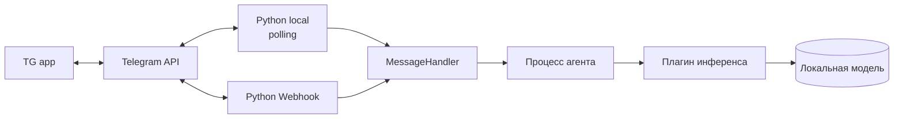

# HomeWork_2 — Telegram-бот с локальной LLM

Бот работает по схеме `User Message → LLM → Bot Reply`. История диалога не хранится:
каждое сообщение — независимый одноразовый запрос.

- **Telegram Bot API — на чистом HTTP** (`urllib` из stdlib), без `telegraf`/`aiogram`.
- **Сторонних зависимостей нет вообще** — ноль supply chain рисков.
- **Расширяемая архитектура**: транспорт и инференс — сменные плагины.
- **Инференс как плагин**: `ollama`, `openai_compat` (vLLM), `echo` — выбор одной переменной.
- **Вызов агента — отдельный процесс**: зависшая модель не роняет и не блокирует бота.

Обоснование решений и план работ — [PLAN.md](PLAN.md).

## Архитектура



| Слой | Где живёт | Что заменяется |
|---|---|---|
| Транспорт | `bot/transports/` | `polling` ↔ `webhook`, переменная `TELEGRAM_TRANSPORT` |
| Логика | `bot/handlers.py` | не зависит ни от транспорта, ни от провайдера |
| Агент | `bot/agent/` | отдельный процесс, пул и супервизор |
| Инференс | `bot/providers/` | `ollama` / `openai_compat` / `echo`, переменная `LLM_PROVIDER` |
| Ядро | `bot/core/` | контракты плагинов и реестр, о конкретных плагинах не знает |

## Быстрый старт

### 1. Ollama и модель

```bash
brew install ollama          # Linux: curl -fsSL https://ollama.com/install.sh | sh
ollama serve &
ollama pull qwen3:1.7b       # ~1.4 GB; полегче — ollama pull tinyllama
```

### 2. Токен

Создай бота у [@BotFather](https://t.me/BotFather) командой `/newbot`.

### 3. Запуск

```bash
cp .env.example .env         # вписать TELEGRAM_BOT_TOKEN
python3 -m bot.main
```

В логах появится `Бот @<имя> запущен`. Проверить всю цепочку без установленной
модели можно заглушкой: `LLM_PROVIDER=echo`.

## Как добавить свой плагин инференса

Один файл в `bot/providers/` — ядро и конфиг править не нужно:

```python
# bot/providers/my_llm.py
from bot.core.contracts import LLMProvider
from bot.providers import register


@register("my_llm")                      # имя для LLM_PROVIDER
class MyProvider(LLMProvider):
    @property
    def model(self) -> str:
        return self._settings.get("MY_MODEL", "default")

    def generate(self, prompt: str) -> str:
        ...                              # LLMError — если не вышло
        return "ответ"
```

Дальше `LLM_PROVIDER=my_llm` в `.env` — и всё. Свои настройки провайдер читает
из `self._settings` (объединённые `.env` и окружение), поэтому новые переменные
не требуют правок `config.py`.

Плагин можно держать и вне репозитория — тогда укажи его пакет в `PLUGIN_PACKAGES`.

Транспорт добавляется так же: файл в `bot/transports/`, наследник `Transport`.

## Переменные окружения

| Переменная | По умолчанию | Назначение |
|---|---|---|
| `TELEGRAM_BOT_TOKEN` | — | **Обязательная.** Токен от @BotFather |
| `TELEGRAM_TRANSPORT` | `polling` | `polling` или `webhook` |
| `LLM_PROVIDER` | `ollama` | `ollama`, `openai_compat`, `echo` |
| `LLM_TIMEOUT` | `120` | Сколько секунд ждать ответ модели |
| `AGENT_WORKERS` | `1` | Сколько процессов агента держать |
| `OLLAMA_URL` | `http://localhost:11434` | Настройка провайдера `ollama` |
| `OLLAMA_MODEL` | `qwen3:1.7b` | Настройка провайдера `ollama` |
| `LLM_BASE_URL` / `LLM_MODEL` / `LLM_API_KEY` | — | Настройки `openai_compat` |
| `WEBHOOK_URL` | — | Публичный HTTPS-адрес (для `webhook`) |
| `WEBHOOK_LISTEN` / `WEBHOOK_PORT` / `WEBHOOK_PATH` | `0.0.0.0` / `8080` / `telegram` | Локальный эндпоинт |
| `WEBHOOK_SECRET_TOKEN` | — | Проверка `X-Telegram-Bot-Api-Secret-Token` |
| `PLUGIN_PACKAGES` | — | Внешние пакеты с плагинами, через запятую |
| `ALLOWED_USER_IDS` | пусто | Whitelist `user_id`; пусто — отвечать всем |
| `POLL_TIMEOUT` | `30` | Таймаут long polling |
| `LOG_LEVEL` | `INFO` | `DEBUG` / `INFO` / `WARNING` / `ERROR` |

Переменные окружения приоритетнее `.env` — это нужно для Docker и systemd.

## Запуск на сервере

Docker Compose, systemd и вынесенная Ollama — в [deploy/README.md](deploy/README.md). Коротко:

```bash
cp .env.example .env && nano .env && chmod 600 .env
docker compose up -d --build
docker compose exec ollama ollama pull qwen3:1.7b
docker compose logs -f bot
```

## Команды бота

| Команда | Действие |
|---|---|
| `/start` | Приветствие и справка (без обращения к модели) |
| `/help` | Справка |
| любой текст | Уходит агенту, ответ возвращается в чат |

## Что учтено

- **Жёсткий таймаут инференса.** Провайдер отваливается сам по `LLM_TIMEOUT`; если процесс завис наглухо — пул снимает его и поднимает заново, бот продолжает работать.
- **Индикатор «печатает»** продлевается в фоне: Telegram гасит его через 5 секунд, а модель на CPU думает дольше.
- **`<think>…</think>`** у reasoning-моделей вырезается в ядре, для всех провайдеров сразу.
- **Лимит 4096 символов** — длинный ответ режется по границе строки.
- **`offset = update_id + 1`**; накопленная за офлайн очередь при старте пропускается.
- **Webhook отвечает `200 OK` мгновенно** — иначе Telegram шлёт повторы, пока модель думает.
- **Конфликт двух копий** на одном токене распознаётся по HTTP 409 и объясняется в логе.
- **Сломанный плагин** логируется, но не мешает запуску остальных.

## Безопасность

- `.env` в `.gitignore`; проверить: `git check-ignore -v .env`.
- Токен не пишется в логи — только `bot_id:***`.
- **Токен Telegram не передаётся в процесс агента**: инференсу он не нужен.
- Webhook принимает апдейты только с верным `X-Telegram-Bot-Api-Secret-Token`.
- Порт Ollama в Docker Compose наружу не публикуется — у неё нет аутентификации.
- `ALLOWED_USER_IDS` ограничивает круг пользователей.
