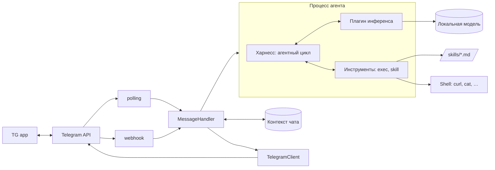

# HomeWork_2 — минимальный AI-агент в Telegram

Бот перестал быть «сообщение → модель → ответ». Теперь это агент: он крутит
цикл `модель → инструмент → модель`, выполняет реальные команды в системе
и читает текстовые инструкции-скиллы.

- **Харнесс и агентный цикл** — модель зовёт инструменты, пока не решит задачу.
- **Защита от зацикливания** — потолок шагов, дедлайн по времени, детектор повторов.
- **Инструмент `exec`** — любая консольная команда: `curl` к REST API, CLI-утилиты, файлы.
- **Скиллы** — `.md`-инструкции в [skills/](skills/); чтобы добавить, код не нужен.
- **Чат — один длинный контекст**, `/new` начинает заново.
- **Telegram Bot API на чистом HTTP** (`urllib`), **ноль сторонних зависимостей**.
- **Транспорт, инференс и инструменты — сменные плагины**.
- **Цикл агента идёт в отдельном процессе**: зависшая модель или команда не роняет бота.

Обоснование решений — [PLAN.md](PLAN.md).

## Архитектура



| Слой | Где живёт | Что заменяется |
|---|---|---|
| Транспорт | `bot/transports/` | `polling` ↔ `webhook`, переменная `TELEGRAM_TRANSPORT` |
| Логика и контекст | `bot/handlers.py`, `bot/core/history.py` | не зависит ни от транспорта, ни от провайдера |
| Харнесс | `bot/agent/harness.py` | сам агентный цикл и разбор вызовов |
| Инструменты | `bot/tools/` | файл = новый инструмент; `TOOLS_DISABLED` отключает |
| Скиллы | `skills/*.md` | инструкции для агента, кода не требуют |
| Инференс | `bot/providers/` | `ollama` / `openai_compat` / `echo`, переменная `LLM_PROVIDER` |
| Ядро | `bot/core/` | контракты плагинов и реестр, о конкретных плагинах не знает |

## Как работает агентный цикл

1. Харнесс собирает контекст: системный промпт (инструменты + каталог скиллов),
   история чата, новый вопрос.
2. Модель отвечает. Если в ответе есть блок вызова — харнесс его разбирает,
   выполняет инструмент и кладёт результат в контекст ролью «Результат инструмента».
3. Шаг 2 повторяется, пока модель не ответит обычным текстом. Это финальный ответ.

Вызов модель пишет текстом:

````
```tool
{"tool": "exec", "args": {"command": "curl -s https://wttr.in/Minsk?0"}}
```
````

Почему текстовый протокол, а не «родной» function calling: у мелких локальных
моделей его либо нет, либо он работает через раз. Разбор снисходительный —
принимаются ```tool-блок, `<tool>`-тег и просто голый JSON, а битый JSON
(неэкранированные кавычки — любимая ошибка мелких моделей) чинится регулярками.
Не разобрали совсем — модель получает ошибку и переписывает вызов, а
пользователь не видит служебного мусора.

### Защита от зацикливания

Три независимых предохранителя:

| Предохранитель | Настройка | Что делает |
|---|---|---|
| Потолок шагов | `AGENT_MAX_STEPS` (8, максимум 10) | на последнем шаге инструменты отключаются, у модели просят финальный ответ |
| Бюджет времени | `AGENT_TASK_TIMEOUT` (300 с) | дедлайн на весь запрос; после него — тоже финальный ответ |
| Детектор повторов | — | второй такой же вызов не выполняется (результат уже в контексте), третий обрывает цикл |
| Снятие процесса | `AGENT_TASK_TIMEOUT` + 15 с | пул убивает зависший процесс и поднимает новый |

Лимит исчерпан — пользователь получает ответ по собранным данным, а не
сообщение «превышен лимит».

### Защита от выдумки

Мелкая модель, столкнувшись с ошибкой вызова, охотно закрывает задачу
правдоподобным текстом: реальная сводка приходила с погодой в городе, который
никто не запрашивал, и с делами, которых нет в `data/agenda.md`. Отсюда четыре
рубежа, от мягкого к жёсткому:

| Рубеж | Где |
|---|---|
| Прямой запрет придумывать результат вызова | системный промпт |
| «Это инструкция, а не ответ» к телу скилла | `bot/tools/skill.py` |
| К тексту любой ошибки инструмента приклеен запрет подставлять значения вместо результата | `ERROR_NUDGE` |
| Ответ после единственного упавшего вызова не принимается: данных у модели нет, значит он выдуман — она получает один шанс сделать вызов правильно | `FABRICATION_GUARD` |

Последний рубеж молчит, как только хоть один инструмент отработал: тогда данные
у модели есть и честное «остального узнать не удалось» — законный ответ.
Отклонённый текст в историю чата не попадает.

## Инструменты

| Инструмент | Что делает |
|---|---|
| `exec` | выполняет команду в shell, возвращает stdout+stderr и код возврата |
| `skill` | читает полный текст скилла по имени |

Свой инструмент — один файл в `bot/tools/`, править ядро не нужно:

```python
# bot/tools/http_get.py
from bot.core.contracts import Tool, ToolError
from bot.tools import register


@register("http_get")                    # имя, которым модель его зовёт
class HttpGetTool(Tool):
    name = "http_get"
    description = "скачивает страницу по URL"
    usage = '{"tool": "http_get", "args": {"url": "https://example.com"}}'

    def run(self, args):
        ...                              # ToolError — если не вышло
        return "текст результата"
```

Описание и пример уходят в системный промпт автоматически.

## Скиллы

Скилл — обычный `.md` с инструкцией. Агент выполняет её сам, имеющимися
инструментами; кода в скилле нет.

| Скилл | Тип | О чём |
|---|---|---|
| [weather-cli](skills/weather-cli.md) | A — инструкция к CLI/API | как ходить `curl` к `wttr.in`: флаги, форматы, разбор ошибок |
| [morning-briefing](skills/morning-briefing.md) | B — рутина | дата → погода → дела из `data/agenda.md` → сводка |

В системный промпт уходит только строка «имя — описание». Тело агент
подгружает инструментом `skill`, когда задача действительно похожа
(progressive disclosure) — контекст модели на 1.7B слишком дорог, чтобы
держать в нём все инструкции сразу.

Во frontmatter у скилла есть `kind`: `procedure` — план, который надо выполнить
по шагам, `reference` — справка по CLI или API. Инструмент `skill` дописывает
к телу разное напоминание: справочник читают и возвращаются к задаче, а не
выполняют его первый код-блок как первый шаг плана. Без ключа скилл считается
процедурой.

Новый скилл: положить файл в `skills/` и перезапустить бота.

```markdown
---
name: my-skill
description: одна строка — по ней агент решает, читать ли инструкцию
---

1. Первый шаг…
```

## Быстрый старт

### 1. Ollama и модель

```bash
brew install ollama          # Linux: curl -fsSL https://ollama.com/install.sh | sh
ollama serve &
ollama pull qwen3:1.7b       # ~1.4 GB
```

`qwen3:1.7b` инструменты вызывает, но многошаговые скиллы иногда комкает:
пропускает шаг или чинит собственный битый JSON со второй попытки. Цикл
от модели не зависит — на `qwen3:4b` и крупнее рутины проходят заметно ровнее.

### 2. Проверить агента без Telegram

```bash
python3 -m bot.cli "Какая сейчас погода в Минске?"
python3 -m bot.cli                       # диалог: /new, /skills, /quit
python3 -m bot.cli --provider echo       # обвязка без модели
```

Видно каждый шаг цикла:

```
⚙️  exec: curl -s https://wttr.in/Minsk?0
Погода в Минске: +16 °C, облачно, ветер 9 км/ч.
[шагов: 2, завершение: answer]
```

### 3. Запуск бота

```bash
cp .env.example .env         # вписать TELEGRAM_BOT_TOKEN от @BotFather
python3 -m bot.main
```

### 4. Тесты

```bash
python3 -m unittest discover -s tests -t .
```

Цикл проверяется на «сценарной» модели — списке заранее записанных ответов,
поэтому тесты идут без Ollama и без сети.

## Как добавить свой плагин инференса

Один файл в `bot/providers/` — ядро и конфиг править не нужно:

```python
# bot/providers/my_llm.py
from bot.core.contracts import LLMProvider
from bot.providers import register


@register("my_llm")                      # имя для LLM_PROVIDER
class MyProvider(LLMProvider):
    @property
    def model(self) -> str:
        return self._settings.get("MY_MODEL", "default")

    def generate(self, prompt: str) -> str:
        ...                              # LLMError — если не вышло
        return "ответ"
```

Дальше `LLM_PROVIDER=my_llm` в `.env` — и всё. Метод `chat()` реализовывать
не обязательно: базовая версия склеит контекст в один промпт, и агентный цикл
заработает с одним только `generate()`. У кого есть настоящий chat-эндпоинт
(`ollama`, `openai_compat`) — переопределяют `chat()` и передают роли как есть.

Плагин можно держать и вне репозитория — тогда укажи его пакет в `PLUGIN_PACKAGES`.
Транспорт добавляется так же: файл в `bot/transports/`, наследник `Transport`.

## Переменные окружения

| Переменная | По умолчанию | Назначение |
|---|---|---|
| `TELEGRAM_BOT_TOKEN` | — | **Обязательная.** Токен от @BotFather |
| `TELEGRAM_TRANSPORT` | `polling` | `polling` или `webhook` |
| `LLM_PROVIDER` | `ollama` | `ollama`, `openai_compat`, `echo` |
| `LLM_TIMEOUT` | `120` | Таймаут одного обращения к модели |
| `AGENT_WORKERS` | `1` | Сколько процессов агента держать |
| `AGENT_MAX_STEPS` | `8` | Потолок шагов цикла, максимум 10 |
| `AGENT_TASK_TIMEOUT` | `300` | Бюджет времени на весь запрос, секунды |
| `AGENT_SHOW_STEPS` | `true` | Показывать в чате «⚙️ exec: …» |
| `SKILLS_DIR` | `./skills` | Каталог со скиллами |
| `TOOLS_ENABLED` / `TOOLS_DISABLED` | пусто | Какие инструменты включены |
| `TOOL_PACKAGES` | — | Внешние пакеты с инструментами |
| `EXEC_TIMEOUT` | `20` | Таймаут одной команды |
| `EXEC_MAX_OUTPUT` | `4000` | Сколько символов вывода уходит модели |
| `EXEC_WORKDIR` | каталог запуска | Рабочий каталог команд |
| `EXEC_ALLOWED_BINARIES` | пусто | Белый список бинарей; пусто — всё, кроме стоп-листа |
| `HISTORY_MAX_MESSAGES` / `HISTORY_MAX_CHARS` | `40` / `12000` | Размер контекста чата |
| `OLLAMA_URL` / `OLLAMA_MODEL` | `http://localhost:11434` / `qwen3:1.7b` | Адрес и модель `ollama` |
| `OLLAMA_NUM_THREAD` | — | Потоков на инференс; в контейнере задавать обязательно |
| `OLLAMA_NUM_CTX` | `8192` | Окно контекста; дефолтных 4096 у Ollama не хватает |
| `OLLAMA_THINK` | не шлётся | `false` выключает размышления модели: втрое быстрее, но qwen3:1.7b перестаёт доводить скилл до ответа |
| `LLM_BASE_URL` / `LLM_MODEL` / `LLM_API_KEY` | — | Настройки `openai_compat` |
| `WEBHOOK_URL` | — | Публичный HTTPS-адрес (для `webhook`) |
| `WEBHOOK_LISTEN` / `WEBHOOK_PORT` / `WEBHOOK_PATH` | `0.0.0.0` / `8080` / `telegram` | Локальный эндпоинт |
| `WEBHOOK_SECRET_TOKEN` | — | Проверка `X-Telegram-Bot-Api-Secret-Token` |
| `PLUGIN_PACKAGES` | — | Внешние пакеты с провайдерами |
| `ALLOWED_USER_IDS` | пусто | Whitelist `user_id`; пусто — отвечать всем |
| `POLL_TIMEOUT` | `30` | Таймаут long polling |
| `LOG_LEVEL` | `INFO` | `DEBUG` / `INFO` / `WARNING` / `ERROR` |

Переменные окружения приоритетнее `.env` — это нужно для Docker и systemd.

## Запуск на сервере

Docker Compose, systemd, Railway и вынесенная Ollama — в [deploy/README.md](deploy/README.md)
(Railway — отдельно в [deploy/railway.md](deploy/railway.md)). Коротко:

```bash
cp .env.example .env && nano .env && chmod 600 .env
docker compose up -d --build
docker compose exec ollama ollama pull qwen3:1.7b
docker compose logs -f bot
```

Контейнер — правильное место для агента с `exec`: команды выполняются
не от root, а `skills/` подключён томом, так что инструкции правятся
без пересборки образа.

## Команды бота

| Команда | Действие |
|---|---|
| `/start` | Приветствие и справка, контекст сбрасывается |
| `/new` | Новый чат: забыть контекст |
| `/skills` | Список известных инструкций |
| `/help` | Справка |
| любой текст | Уходит агенту; в чат прилетают шаги `⚙️ …` и финальный ответ |

## Что учтено

- **Три предохранителя от зацикливания** плюс снятие зависшего процесса.
- **Битый JSON от модели чинится**, а совсем неразобранный вызов возвращается модели как ошибка — пользователь служебных блоков не видит.
- **Ошибка инструмента — не авария**: текст ошибки уходит модели, она исправляется на следующем шаге.
- **Осечка модели не стоит целого прогона**: пустой ответ на финальном шаге — повод переспросить, а не выбросить всё, что агент уже собрал инструментами.
- **Ответ вместо исправления не проходит**: пока ни один инструмент не отработал, финальный текст после сбоя — выдумка, и цикл возвращает модель к вызову.
- **Прогресс виден в чате**: какие команды выполняются от имени пользователя, понятно сразу.
- **Контекст обрезается** по числу сообщений и символов, вывод команд в истории укорачивается: мелкая модель не захлёбывается.
- **Скиллу приклеивается напоминание** «это инструкция, а не ответ» — без него модель охотно заполняет шаблон выдуманными числами.
- **`<think>…</think>`** у reasoning-моделей вырезается в ядре, для всех провайдеров сразу.
- **Лимит 4096 символов** — длинный ответ режется по границе строки.
- **Webhook отвечает `200 OK` мгновенно**, `offset = update_id + 1`, конфликт двух копий распознаётся по HTTP 409.
- **Сломанный плагин или инструмент** логируется, но не мешает запуску остальных.

## Безопасность

`exec` — это выполнение произвольных команд по решению языковой модели.
Ограничения ниже — перила от случайной беды и галлюцинации, а **не песочница**.

- **Стоп-лист**: `rm -rf /`, `mkfs`, `dd of=/dev/`, `shutdown`, fork-бомба, `curl … | sh`, `sudo`, чтение `.env` — блокируются до запуска.
- **Белый список** `EXEC_ALLOWED_BINARIES` — строгий режим, если агент нужен для одной конкретной задачи.
- **Таймаут и обрезка вывода** — зависшая команда снимается, гигабайтный вывод не попадает в контекст.
- **Секреты не уходят в дочерний процесс**: переменные с `TOKEN`, `SECRET`, `API_KEY`, `PASSWORD` вычищаются из окружения команды.
- **Токен Telegram не передаётся в процесс агента** — ни инференсу, ни инструментам он не нужен.
- **Отдельный процесс** для цикла: тяжёлая команда не блокирует и не роняет бота.
- **`ALLOWED_USER_IDS`** — обязательно заполнить: без него команды в системе может выполнять любой, кто нашёл бота.
- **Контейнер и пользователь без sudo** — настоящая изоляция. На хосте запускай от отдельного пользователя.
- `.env` в `.gitignore`; токен не пишется в логи — только `bot_id:***`.
- Порт Ollama в Docker Compose наружу не публикуется — у неё нет аутентификации.
